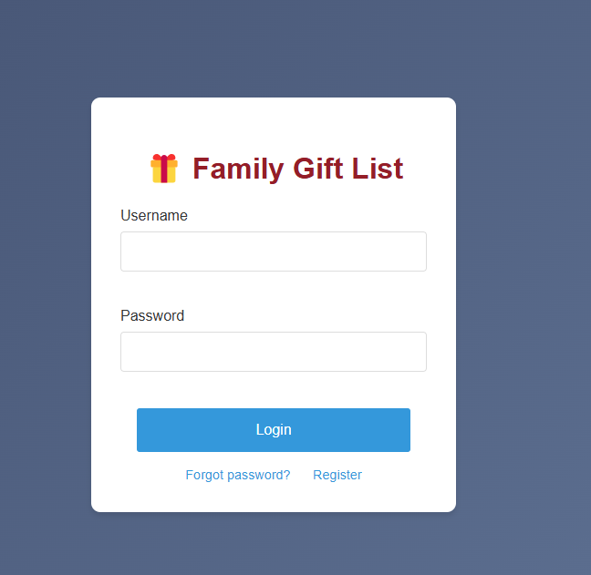
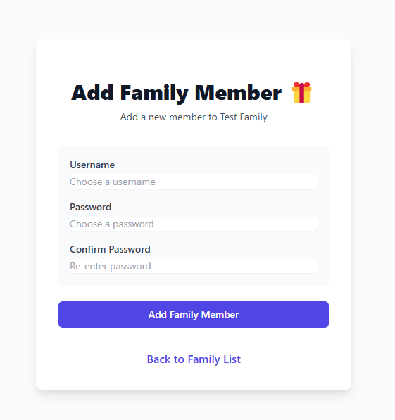
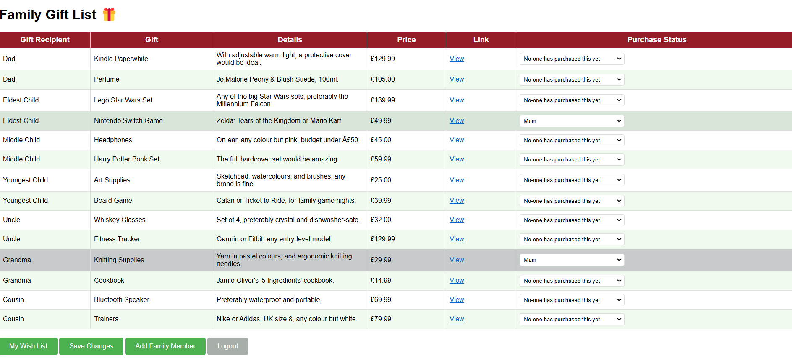
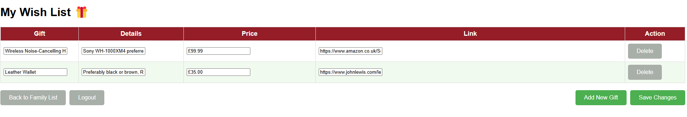

# Family Gift Registry App

A Flask-based web application that helps families manage their gift lists and coordinate gift-giving. Ideal for making Xmas Lists. Family members can create wishlists, view other family members' lists and mark gifts as purchased to avoid purchasing duplicate gifts.

## Features

- **User Authentication**: Secure login system for family members
- **Family Groups**: Users can create or join family groups
- **Gift Management**: 
  - Add, edit, and delete gifts from personal wishlists
  - Include details like price, description, and links
  - Mark gifts as purchased to avoid duplicates
- **Demo Modes**:
  - Pre-populated family demonstration with sample gift data
  - Empty family group for testing new user experiences

## Screenshots  

### Login Page  
  

### Create Family


### Add New Family Member


### Family Wish List  
  

### User Wish List



## Technology Stack

- Backend: Python/Flask
- Database: SQLite with SQLAlchemy ORM
- Authentication: Flask-Login
- Frontend: HTML/CSS with Flask templating

## Prerequisites  

- Python 3.12 or later  

## Installation

```bash
1. Clone the repository: # to download project files 
git clone [your-repository-url]
cd gift-registry-app
```

2. Create and activate a virtual environment: 
A virtual environment (venv) is a self-contained directory that keeps the app's dependencies separate from your system-wide Python packages. This prevents version conflicts and makes managing dependencies easier.

- On Linux/macOS (bash):  
```bash
python3 -m venv venv
source venv/bin/activate
```  

- On Windows (Command Prompt or PowerShell):  
```cmd
python -m venv venv
venv\Scripts\activate
```  


3. Install dependencies: 
```bash
pip install -r requirements.txt # to install necessary packages
```

4. Initialize the database: 
```bash
flask seed-db # sets-up database structure and seeds with the demo data
```

5. Run the application:
```bash
python demo_gift_list_app.py
```

6. Visit `http://localhost:5000` in your browser

## Demo Accounts

The application comes with two demo families:

1. Pre-populated Family (Test Family):
   - Usernames:  "Mum", "Dad", "Eldest Child", "Middle Child", "Youngest Child", "Uncle", "Grandma", "Cousin"
   - All Passwords: "demo123"

2. Empty Demo Family (Placeholder Family):
   - Username: "demo_user1"
   - All Passwords: "demo123"

Use these accounts to explore the app and its features.

## Project Structure

```
gift-registry-app/
├── demo_gift_list_app.py    # Main application file
├── instance/               # Database directory (auto-generated)
├── seeds/                 # Seed data for demo
│   └── demo_data.json    # Pre-populated/Test family data
├── static/               # Static files (CSS, JS)
├── templates/            # HTML templates
└── requirements.txt      # Project dependencies
└── README.md                 # Project documentation
```

## Development

To set up the development environment:

1. Fork the repository                  # to create your own personal copy
2. Create a new branch for your feature
3. Make changes and test thoroughly
4. Submit a pull request

## Future Enhancements

Other possible features:
- Email notifications for new gifts
- Gift reservation system
- Multiple family group support
- Mobile app version

## License

This project is licensed under the MIT License - see the LICENSE file for details.

